# test_sql

### Phần C

Sau khi tạo bảng ([scrip](https://github.com/ke666/test_sql/blob/main/tao_bang.sql)), ta có kết quả bảng:
<p align="center"> 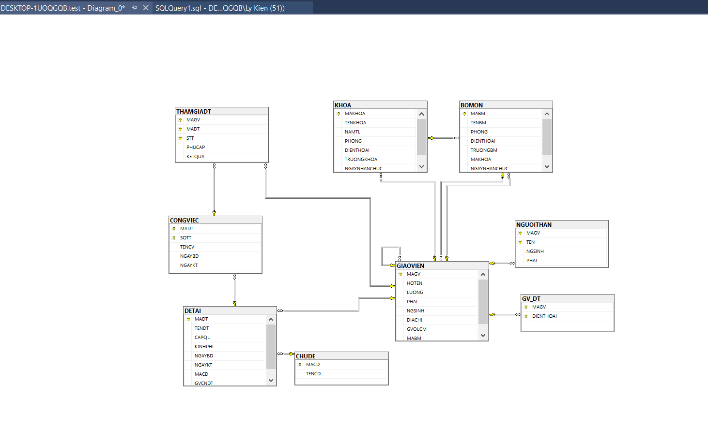 </p>

Và nhập data, được kết quả. 

<p align="center"> 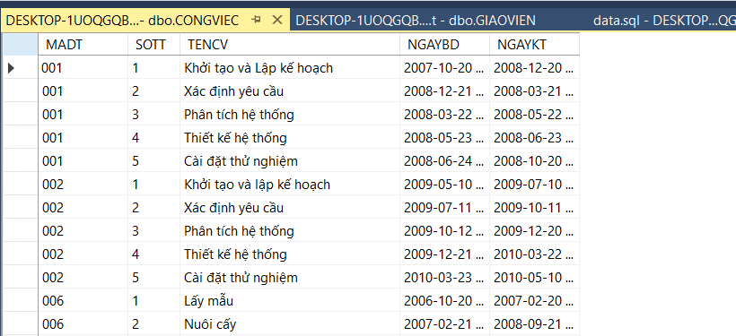 </p>
<p align="center"> 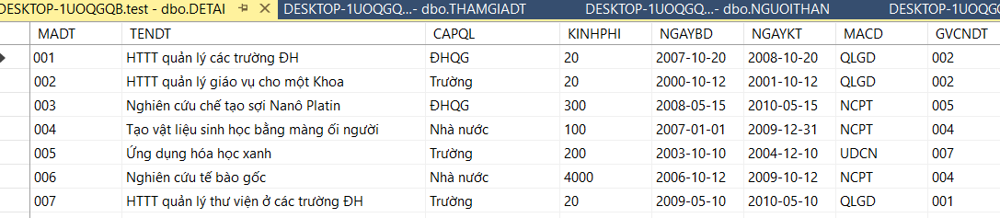 </p>
<p align="center"> 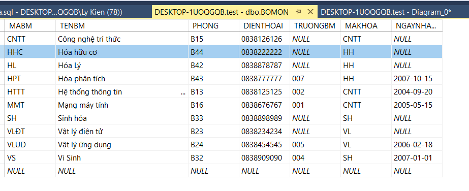 </p>
<p align="center"> 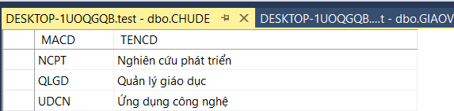 </p>
<p align="center"> 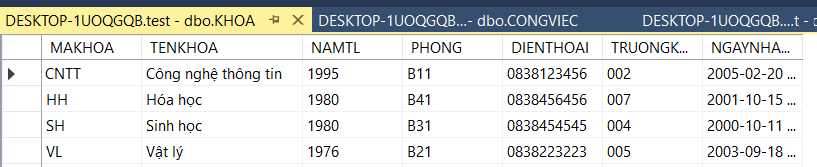 </p>
<p align="center"> 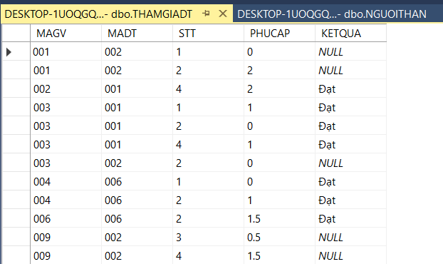 </p>
<p align="center"> 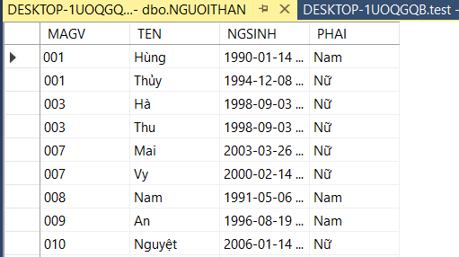 </p>
<p align="center"> 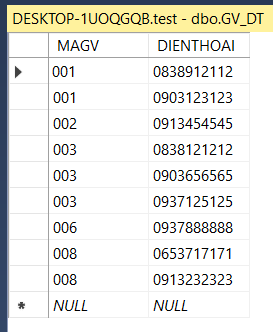 </p>


### Phần D 
([script](https://github.com/ke666/test_sql/blob/main/tao_bang.sql))

Câu 1: 
```SQL
(select MAGV
from GIAOVIEN 
where LUONG > 2000 and HOTEN like N'Nguyễn%')
union
(select gv.magv
from giaovien gv join bomon bm on gv.magv = bm.truongbm
where year(bm.NGAYNHANCHUC)> 1995 )
```
<p align="center"> 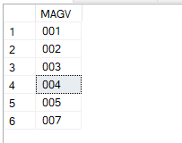 </p>

Câu 2:
```SQL
SELECT  gv.HOTEN, bm.* 
from GIAOVIEN gv left join BOMON bm on gv.MABM = bm.MABM
```
<p align="center"> 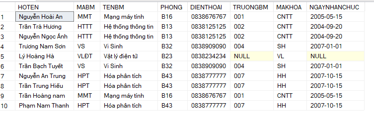 </p>

Câu 3:
```SQL
SELECT HOTEN
  FROM GIAOVIEN GV, BOMON BM
  WHERE BM.TENBM = N'Hệ thống thông tin' AND GV.MABM = BM.MABM
      AND YEAR(GV.NGSINH) = (SELECT MIN(YEAR(GV1.NGSINH))
                FROM GIAOVIEN GV1, BOMON BM1
                WHERE BM1.TENBM = N'Hệ thống thông tin' AND GV1.MABM = BM1.MABM)
```
<p align="center"> 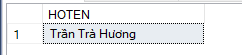 </p>

Câu 4:
```SQL
SELECT HOTEN
  FROM GIAOVIEN GV
  WHERE GV.MAGV IN (SELECT GV1.MAGV
            FROM GIAOVIEN GV1, DETAI DT1
            WHERE GV1.MAGV = DT1.GVCNDT 
            GROUP BY GV1.MAGV
            HAVING COUNT(*) >= ALL (SELECT (COUNT(*))
                        FROM GIAOVIEN GV2, DETAI DT2
                        WHERE GV2.MAGV = DT2.GVCNDT 
                        GROUP BY GV2.MAGV)
)
```

<p align="center"> 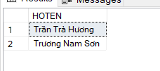 </p>

Câu 5:
```SQL
SELECT HOTEN, TENBM
  FROM GIAOVIEN GV, BOMON BM
  WHERE GV.MABM = BM.MABM AND EXISTS (SELECT GV2.MAGV
                      FROM GIAOVIEN GV2, THAMGIADT TG
                      WHERE GV2.MAGV = TG.MAGV  AND GV.MAGV = GV2.MAGV
                      GROUP BY GV2.MAGV
                      HAVING COUNT(*) >=ALL (SELECT (COUNT(*))
                                  FROM GIAOVIEN GV3, THAMGIADT TG3
                                  WHERE GV3.MAGV = TG3.MAGV
                                  GROUP BY GV3.MAGV))
```
<p align="center"> 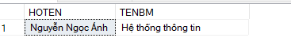 </p>

Câu 6:
```SQL
SELECT TENDT
FROM DETAI DT
WHERE DT.MADT IN(SELECT DT.MADT
        FROM DETAI DT
        WHERE NOT EXISTS (SELECT GV.MAGV
                  FROM GIAOVIEN GV, BOMON BM
                  WHERE GV.MABM = BM.MABM and BM.TENBM=N'Hệ thống thông tin'                               
                  EXCEPT
                  SELECT TG.MAGV
                  FROM THAMGIADT TG
                  WHERE DT.MADT = TG.MADT  
                  )
)  
```
<p align="center">  </p>

Câu 7:
```SQL
SELECT HOTEN
FROM  GIAOVIEN GV
WHERE GV.MAGV IN(SELECT GV.MAGV
        FROM THAMGIADT TG, DETAI DT
        WHERE NOT EXISTS (SELECT DT.MADT
                  FROM GIAOVIEN GV JOIN DETAI DT ON DT.GVCNDT=GV.MAGV
                  WHERE  GV.HOTEN = N'Trần Trà Hương'
                  EXCEPT
                  SELECT TG.MADT
                  FROM THAMGIADT TG
                  WHERE GV.MAGV = TG.MAGV 
                  )
)  
```
<p align="center"> 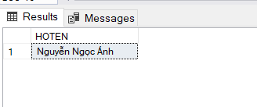 </p>

Câu 8:
```SQL
SELECT TENDT
FROM DETAI DT
WHERE DT.MADT IN(SELECT DT.MADT
        FROM DETAI DT
        WHERE NOT EXISTS (SELECT GV.MAGV
                  FROM GIAOVIEN GV, BOMON BM
                  WHERE GV.MABM = BM.MABM AND BM.MAKHOA = 'CNTT'
                  EXCEPT
                  SELECT TG.MAGV
                  FROM THAMGIADT TG
                  WHERE DT.MADT = TG.MADT
                    )
                  )
```
<p align="center"> 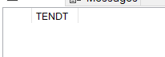 </p>

Câu 9:
```SQL
SELECT TENDT
FROM DETAI DT
WHERE DT.MADT IN(SELECT DT.MADT
        FROM DETAI DT
        WHERE NOT EXISTS(SELECT GV.MAGV
                  FROM GIAOVIEN GV , BOMON BM, KHOA K
                  WHERE GV.MABM = BM.MABM AND BM.MAKHOA = K.MAKHOA AND K.TENKHOA=N'Sinh học'
                  EXCEPT
                  SELECT TG.MAGV
                  FROM THAMGIADT TG
                  WHERE DT.MADT = TG.MADT
                    )
)
```
<p align="center"> 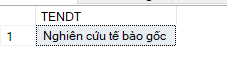 </p>

Câu 10:
```SQL
SELECT GV.MAGV, GV.HOTEN, BM.TENBM, GV.GVQLCM
FROM  GIAOVIEN GV
JOIN  THAMGIADT TG  ON GV.MAGV = TG.MAGV
JOIN BOMON BM ON GV.MABM = BM.MABM
WHERE TG.MAGV IN(SELECT DISTINCT TG.MAGV
					FROM THAMGIADT TG, DETAI DT
				WHERE NOT EXISTS (SELECT distinct  DT.MADT
                  FROM CHUDE CD ,DETAI DT 
                  WHERE CD.MACD = DT.MACD and CD.TENCD = N'Nghiên cứu phát triển'
                  EXCEPT
                  SELECT DISTINCT  TG.MADT
                  FROM THAMGIADT TG ,DETAI DT 
                  WHERE TG.MADT = DT.MADT
                  )
)  

```
<p align="center">  </p>
